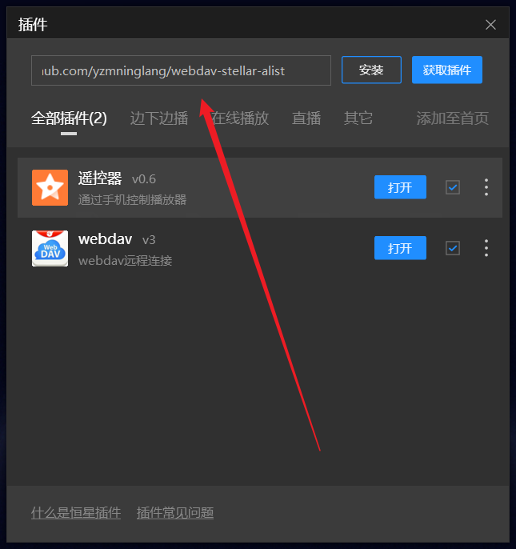

# Stellar WebDAV with AList Integration

Stellar WebDAV 项目旨在提供一个简单而强大的 WebDAV 服务器解决方案。本项目基于原有的 stellar-webdav 进行了扩展，新增了对 AList 的支持，并在用户界面上增加了路径参数输入框，允许用户以`dav/...`格式指定访问路径。

## 特性

- **增强的 AList 支持**：现在，您可以通过 Stellar WebDAV 轻松地与 AList 平台集成，实现更高效的文件管理。
- **灵活的路径参数**：通过在原有界面中添加路径参数输入框，用户可以方便地使用`dav/...`格式直接访问特定资源或目录。
- **易于部署和使用**：保持 stellar-webdav 一贯的简洁易用风格，只需几个步骤即可完成设置并开始使用。

## 快速开始

